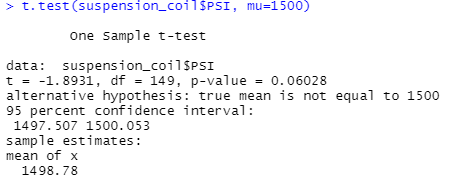
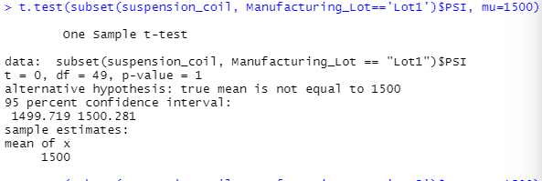
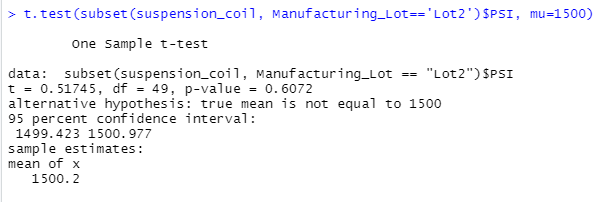
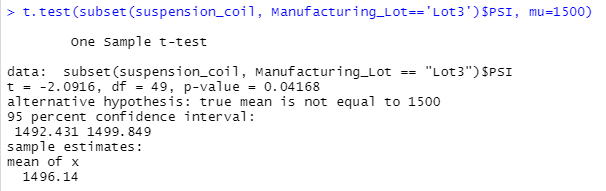

# MechaCar_Statistical_Analysis

## Linear Regression to Predict MPG

Which variables/coefficients provided a non-random amount of variance to the mpg values in the dataset?
vehicle weight and spoiler angle provide a non random amount of variance.

Is the slope of the linear model considered to be zero? Why or why not?
The p-value is 5.35e-11 which means our slope is not 0 

Does this linear model predict mpg of MechaCar prototypes effectively? Why or why not?
With an R squared value of 71% this lead us to know that this model will more than likely produce correct values

## Summary Statistics on Suspension Coils
The design specifications for the MechaCar suspension coils dictate that the variance of the suspension coils must not exceed 100 pounds per square inch. Does the current manufacturing data meet this design specification for all manufacturing lots in total and each lot individually? Why or why not?
The total has a variance of 62.29.  Lot 1 and 2 are well within the allowed variance at 0.98 and 7.47 respectally.  However Lot 3 does not with a variance of 170.

## T-Tests on Suspension Coils

## Study Design: MechaCar vs Competition

